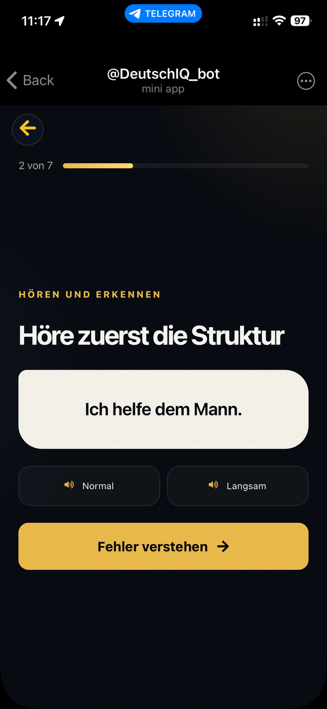
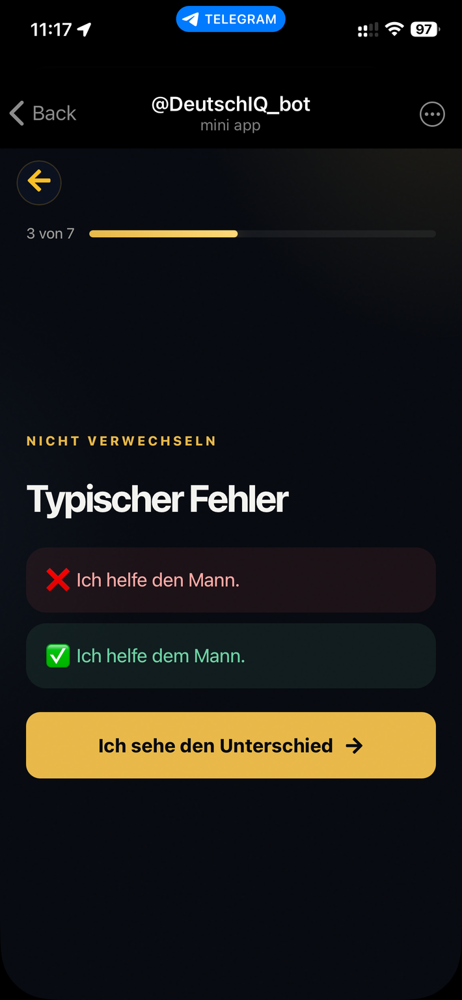
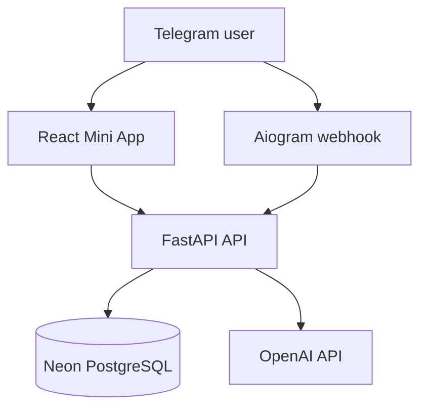

# DeutschIQ

<p align="center">
  
</p>

<p align="center">
  <a href="https://deutschiq.onrender.com/"><strong>Live Web App</strong></a>
  ·
  <a href="https://t.me/DeutschIQ_bot"><strong>Open Telegram Bot</strong></a>
  ·
  <a href="docs/DEPLOYMENT.md"><strong>Deployment Guide</strong></a>
</p>

<p align="center">
  
  
  
  
</p>

## About

DeutschIQ is an AI-assisted Telegram Mini App for adaptive German learning. It combines a protected level diagnostic, a personalized 30-day curriculum, mastery-based exercises, spaced review, progress analytics, and an AI tutor in a mobile-first learning flow.

The public application runs as a Docker service on Render with a signed Telegram webhook and managed PostgreSQL on Neon.

> The free Render instance can take up to a minute to wake after inactivity.

## Product preview

<p align="center">
  
  
  
</p>

<p align="center">
  
  
  
</p>

<p align="center">
  
  
  
</p>

## Key features

- Telegram-authenticated onboarding and returning-user flow
- Adaptive A1–B2 diagnostic without exposing answers to the client
- Personalized 30-day roadmap with 30 lessons and 90 exercises
- Mastery gates, retry logic, confidence tracking, and spaced review
- Grammar, vocabulary, reading, listening, and productive activities
- Server-side answer validation and structured feedback
- AI tutor with backend-managed history and daily limits
- Progress analytics, mistakes, XP, streaks, and achievements
- Russian and German interface
- Mobile Telegram WebView design with reduced-motion support
- Signed webhook for permanent cloud operation

## Architecture



| Layer | Technology |
| --- | --- |
| Mini App | React, TypeScript, Vite, React Router |
| Backend | Python 3.12, FastAPI, SQLAlchemy, Pydantic |
| Telegram | aiogram 3, signed webhook, Web App authentication |
| Learning | mastery scoring, adaptive review, structured diagnostics |
| Database | PostgreSQL on Neon |
| AI | OpenAI API with deterministic fallback |
| Delivery | Docker, Render, GitHub Actions |

## Repository structure

```text
DeutschIQ/
├── backend/
│   ├── app/api/endpoints/   # FastAPI routes
│   ├── app/bot/             # Telegram bot and webhook
│   ├── app/models/          # SQLAlchemy models
│   ├── app/services/        # Learning and diagnostic logic
│   ├── tests/
│   ├── init_db.py
│   └── seed_30_day_plan.py
├── frontend/mini-app/       # React Telegram Mini App
├── docs/screenshots/        # Product screenshots
├── Dockerfile
└── docker-compose.yml
```

## Local development

Requirements: Python 3.11+, Node.js 20+, Docker Desktop, and an HTTPS tunnel for Telegram testing.

```powershell
Copy-Item .env.example .env
docker compose up -d postgres

cd backend
python -m venv venv
.\venv\Scripts\Activate.ps1
pip install -r requirements.txt
python init_db.py
python seed_30_day_plan.py
python validate_content.py

cd ..\frontend\mini-app
npm install
npm run build
```

Run the API and polling bot in separate terminals:

```powershell
cd backend
uvicorn app.main:app --host 0.0.0.0 --port 8000
```

```powershell
cd backend
python -m app.bot.main
```

## Production

- Live application: [deutschiq.onrender.com](https://deutschiq.onrender.com/)
- Telegram entry point: [@DeutschIQ_bot](https://t.me/DeutschIQ_bot)
- Health endpoint: [`/api/health`](https://deutschiq.onrender.com/api/health)
- Runtime: Render Docker Web Service
- Database: Neon pooled PostgreSQL
- Bot transport: signed Telegram webhook

Render rebuilds the service from GitHub when the production branch changes. Production credentials are stored as hosting environment variables, never in the repository.

## Testing

```powershell
cd backend
python -m pytest tests -v

cd ..\frontend\mini-app
npm ci
npm run build
```

The same checks run in GitHub Actions.

## Security

- Telegram `initData` is validated server-side.
- Webhook requests use Telegram's secret-token header.
- Diagnostic and lesson answers remain server-side.
- Local `.env` files, tokens, API keys, database credentials, virtual environments, dependencies, and builds are excluded from Git.

If a credential is exposed, revoke it immediately and replace it in the hosting environment.

## Author

Built as a full-stack portfolio project by [eldeville1-hue](https://github.com/eldeville1-hue), with AI-assisted development used as part of the engineering workflow.
